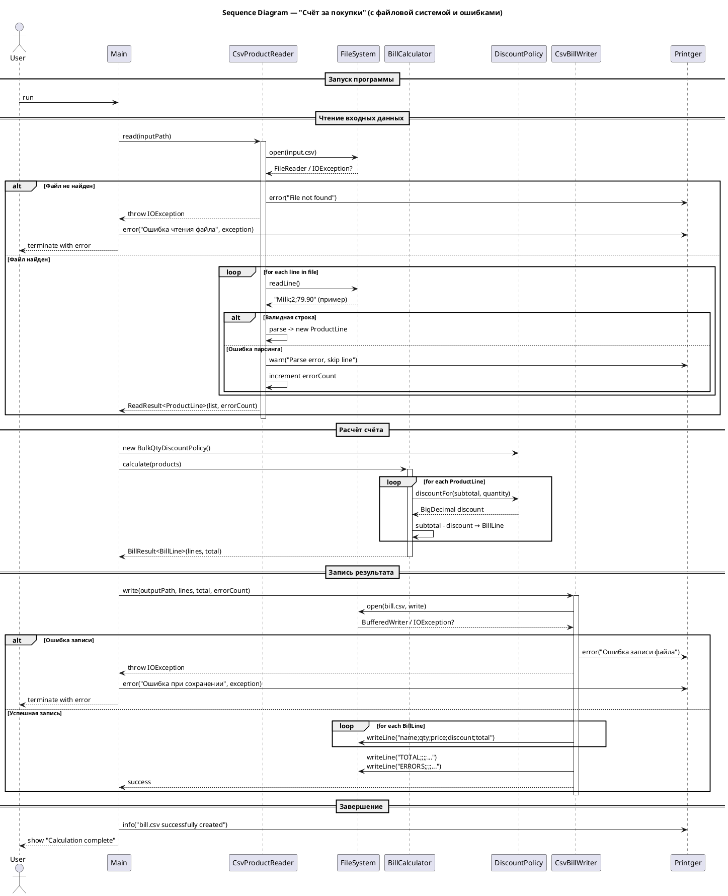

# «Счёт за покупки» (CSV → расчёт → CSV)

## Вход

CSV-файл `products.csv`, строки формата:
`name;quantity;price`

Требования к входу:

* Пустые строки и строки, начинающиеся с `#`, игнорировать.
* Ровно 3 поля, разделитель `;`, пробелы по краям — обрезать.
* `quantity` — целое число `int ≥ 0`.
* `price` — денежное значение, **только** `BigDecimal` (создавать из строки).
* Если произошли ошибки парсинга/валидации — строка пропускается и увеличивает счётчик ошибок.

Пример:

```
Milk;2;79.90
Bread;1;45
Eggs;12;6.50
# comment
Oil;3;110
```

## Правила обработки

1. Для каждой позиции: `subtotal = unitPrice * quantity` (BigDecimal).
2. Скидка: если `quantity ≥ 3`, применить **10%** от `subtotal` (absolute discount).
3. `finalTotal = subtotal − discount`.
4. Денежные значения на **выходе** округлить до 2 знаков `RoundingMode.HALF_UP`.
5. Суммарный итог `TOTAL` — сумма всех `finalTotal`, также 2 знака `HALF_UP`.

## Выход

CSV-файл `bill.csv` со строками:
`name;quantity;price;discountApplied(0/1);finalTotal`

В конце добавить служебные строки:

```
TOTAL;;;;<сумма_по_всем>
ERRORS;;;;<количество_пропущенных_строк>
```

Числа выводить через `toPlainString()`.

## Технические ограничения

* Денежные расчёты — только `BigDecimal`.
* Использовать дженерики и `ArrayList`.

---

# JavaDoc + сигнатуры (без реализаций)

```java
import java.math.BigDecimal;

/**
 * Представляет одну строку входного CSV "name;quantity;price".
 * Контракт:
 *  • Имплементация должна быть неизменяемой.
 *  • Валидировать в конструкторе:
 *      - name не пустой (после trim);
 *      - quantity >= 0;
 *      - unitPrice >= 0.
 *  • Денежные значения хранить в BigDecimal, создавать только из строки.
 */
public interface ProductLine {
    String getName();
    int getQuantity();
    BigDecimal getUnitPrice();
}
```

```java
import java.math.BigDecimal;

/**
 * Рассчитанная позиция счёта.
 * Контракт:
 *  • unitPrice и finalTotal на уровне объекта уже приведены к масштабу 2 и округлены HALF_UP. .setScale(2, RoundingMode.HALF_UP)
 *  • discountApplied должен быть true, если на позицию применена скидка.
 */
public interface BillLine {
    String getName();
    int getQuantity();
    BigDecimal getUnitPrice();      // 2 знака, HALF_UP
    boolean isDiscountApplied();
    BigDecimal getFinalTotal();     // 2 знака, HALF_UP
}
```

```java
import java.math.BigDecimal;

/**
 * Политика скидок.
 * Контракт:
 *  • На вход поступает subtotal = unitPrice * quantity (без финального округления).
 *  • Вернуть абсолютную сумму скидки (>= 0), масштаб не фиксируется — финальное округление выполняет вызывающая сторона.
 */
public interface DiscountPolicy {
    BigDecimal discountFor(BigDecimal subtotal, int quantity);
}
```

```java
import java.util.ArrayList;

/**
 * Результат чтения входных данных.
 * @param <T> тип элементов (в данном случае нужно подставлять — ProductLine).
 *
 * Контракт:
 *  • getItems() возвращает ArrayList
 *  • getErrorCount() — число строк, пропущенных из-за ошибок парсинга/валидации.
 */
public interface ReadResult<T> {
    ArrayList<T> getItems();
    int getErrorCount();
}
```

```java
import java.math.BigDecimal;
import java.util.ArrayList;

/**
 * Результат расчёта счёта.
 * @param <T> тип рассчитанных строк (в данном случае — BillLine).
 *
 * Контракт:
 *  • getLines() — ArrayList всех позиций счёта.
 *  • getTotal() — общая сумма по всем позициям, округлённая до 2 знаков HALF_UP.
 */
public interface BillResult<T> {
    ArrayList<T> getLines();
    BigDecimal getTotal();
}
```

```java
import java.io.IOException;

/**
 * Читает входной CSV (по умолчанию "products.csv") и формирует ReadResult<ProductLine>.
 * Правила:
 *  • Пустые и начинающиеся с '#' строки — игнорируются.
 *  • Ожидается формат "name;quantity;price" (ровно 3 поля).
 *  • quantity парсится как int >= 0; price — BigDecimal из строки.
 *  • Ошибочные строки пропускаются и увеличивают счётчик ошибок.
 * Ограничения: без Stream API; использовать BufferedReader.
 */
public interface CsvProductReader {
    ReadResult<ProductLine> read(String path) throws IOException;
}
```

```java


import java.util.ArrayList;

/**
 * Выполняет расчёт счёта:
 *  1) subtotal = unitPrice * quantity (BigDecimal);
 *  2) discount = policy.discountFor(subtotal, quantity);
 *  3) finalTotal = subtotal - discount;
 *  4) Привести unitPrice и finalTotal к масштабу 2 (HALF_UP) в создаваемых BillLine;
 *  5) total = сумма всех finalTotal, также 2 знака, HALF_UP.
 * Ограничения: без Stream API; обход ArrayList через циклы.
 */
public interface BillCalculator {
    BillResult<BillLine> calculate(ArrayList<ProductLine> products);
}
```

```java


import java.io.IOException;
import java.math.BigDecimal;
import java.util.ArrayList;

/**
 * Записывает результат в CSV ("bill.csv") в формате:
 *  name;quantity;price;discountApplied(0/1);finalTotal
 * После всех позиций дописывает:
 *  TOTAL;;;;<сумма_по_всем>
 *  ERRORS;;;;<количество_пропущенных_строк>
 *
 * Требования:
 *  • Кодировка UTF-8; BufferedWriter; без Stream API.
 *  • Денежные значения выводить через BigDecimal#toPlainString().
 */
public interface CsvBillWriter {
    void write(String path,
               ArrayList<BillLine> lines,
               BigDecimal total,
               int errors) throws IOException;
}
```

```java


/**
 * Алгоритм:
 *  1) Прочитать вход: CsvProductReader#read → ReadResult<ProductLine>;
 *  2) Создать DiscountPolicy (скидка 10% при quantity ≥ 3);
 *  3) Посчитать счёт: BillCalculator#calculate → BillResult<BillLine>;
 *  4) Записать результат: CsvBillWriter#write (включая TOTAL и ERRORS).
 *
 * Реализация должна:
 *  • использовать BigDecimal для денег;
 *  • обходить коллекции через циклы (без Stream API);
 *  • использовать дженерики и ArrayList;
 *  • аккуратно округлять денежные значения до 2 знаков (HALF_UP) на выходе.
 */
public final class Main {
    public static void main(String[] args) {
    }
}
```

# Схема работы
